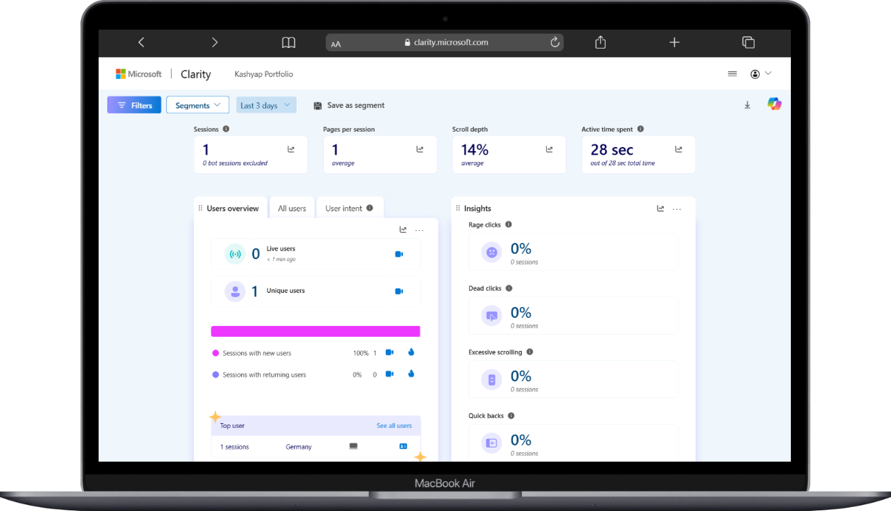

## KAshyap Prajapati Portfolio

---
### Github pages Link
https://kashyapprajapat.github.io/kp_Portfolio/

### Sevalla Link 
https://kashyap-87kfr.sevalla.page/

---

##### Glimps


---

---

### Microsoft Clarity Report


---

### 🤖 Portfolio MCP Server

This repository also ships a **Model Context Protocol (MCP) server** that exposes my
portfolio — profile, skills, projects, experience, education, and contact — as
structured tools and resources for AI assistants (VS Code, Claude Desktop, Cursor, etc.).

It reads live from `skills.json` and `projects/projects.json`, so it always stays in
sync with the website.

---

## 🌐 Live MCP server — use it in your AI assistant

The MCP server is deployed **right alongside this website** as a Vercel Serverless
Function, so anyone can connect to it with a single URL — **no install required**:

```
https://www.kashyapprajapati.in/mcp
```

Add it to any MCP-compatible client and ask plain-English questions like
*"What's Kashyap's experience?"*, *"Does he know Docker and Go?"* or
*"Show me his backend projects."* — the assistant answers using live data from this site.

### VS Code (`.vscode/mcp.json`)

```jsonc
{
  "servers": {
    "kashyap-portfolio": {
      "type": "http",
      "url": "https://www.kashyapprajapati.in/mcp"
    }
  }
}
```

Then open Copilot Chat in **Agent mode** — the tools appear automatically.

### Cursor (`.cursor/mcp.json`)

```jsonc
{
  "mcpServers": {
    "kashyap-portfolio": {
      "url": "https://www.kashyapprajapati.in/mcp"
    }
  }
}
```

### Claude Desktop (`claude_desktop_config.json`)

Claude launches local processes, so bridge the URL with
[`mcp-remote`](https://www.npmjs.com/package/mcp-remote):

```jsonc
{
  "mcpServers": {
    "kashyap-portfolio": {
      "command": "npx",
      "args": ["-y", "mcp-remote", "https://www.kashyapprajapati.in/mcp"]
    }
  }
}
```

### Try it instantly (MCP Inspector)

```bash
npx @modelcontextprotocol/inspector
```

Pick transport **Streamable HTTP**, enter `https://www.kashyapprajapati.in/mcp`,
and explore every tool in a UI.

---

## ⚙️ How the live endpoint works

| File | Role |
| --- | --- |
| [`api/mcp.js`](./api/mcp.js) | Vercel Serverless Function — Streamable HTTP transport (stateless) |
| [`api/_portfolio.js`](./api/_portfolio.js) | Shared portfolio data + MCP server builder (fetches `skills.json` / `projects.json` over HTTPS) |
| [`vercel.json`](./vercel.json) | Rewrites `/mcp` → `/api/mcp` and sets the function timeout |
| [`package.json`](./package.json) | Declares `@modelcontextprotocol/sdk` + `zod` so Vercel installs them for the function |

It runs **stateless** (a fresh server per request), so it needs **no database and no
Redis** and stays fully within Vercel's **free Hobby tier**. Pushing to the repo
auto-deploys the updated endpoint.

A local **stdio** version of the same server also lives in
[`mcp-server/`](./mcp-server) for development.

**Available tools:** `get_profile`, `get_contact`, `get_experience`, `get_education`,
`list_skills`, `list_projects`, `search_projects`, `list_project_categories`,
`get_resume_summary`

**Resources:** `portfolio://profile`, `portfolio://skills`, `portfolio://projects`

See [`mcp-server/README.md`](./mcp-server/README.md) for full client setup and details.

---

# Thank You. ☕🍵🧋